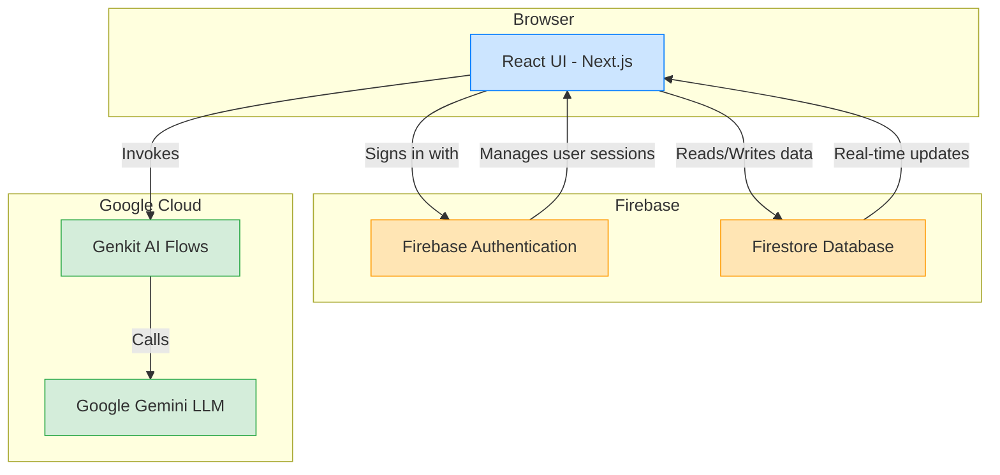
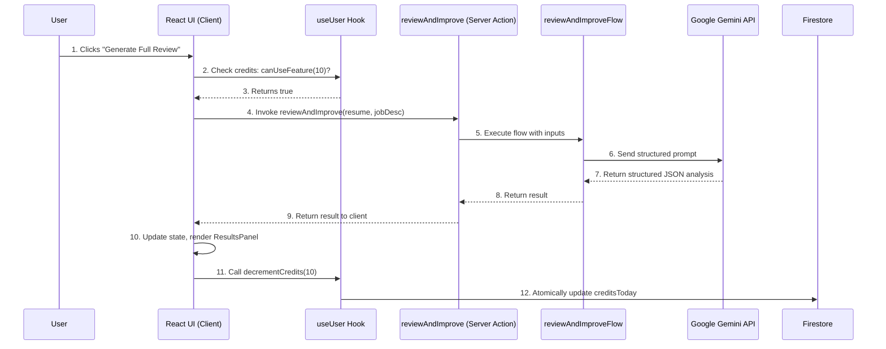

# Application Architecture

CareerCraft AI is built on a modern, serverless architecture that leverages the power of Next.js and Firebase for a scalable, secure, and efficient system. The architecture prioritizes a rich, interactive client-side experience while offloading heavy computation and AI tasks to server-side components.

## System Design Diagram

The following diagram illustrates the major components of the application and how they interact.

---

## 1. Frontend (Client-Side)

-   **Technology**: Built with the **Next.js App Router**, **React**, **TypeScript**, **ShadCN UI**, and styled with **Tailwind CSS**.
-   **Responsibility**: Manages the entire user interface and experience. This includes the multi-step resume wizard, the guided builder, and the interactive results panel for viewing AI feedback.
-   **State Management**: Utilizes React hooks (`useState`, `useContext`). A central `UserProvider` (`src/hooks/useUser.ts`) manages the global authentication state and user data from Firestore, making it available throughout the app via the `useUser` hook.
-   **Communication**:
    -   Invokes **Server Actions** to communicate with the AI backend. These are type-safe functions that run on the server but can be called directly from client components, simplifying the client-server boundary.
    -   Uses the **Firebase SDK** for direct interaction with Firebase Authentication and for real-time data synchronization with Firestore.
-   **Privacy-First File Handling**: All resume file parsing (`.pdf`, `.docx`, `.txt`) is handled locally in the user's browser using libraries like `pdf.js` and `mammoth`. **Files are never uploaded to a server**, ensuring user privacy and reducing backend complexity.

---

## 2. Backend (Server-Side)

The backend is entirely serverless, composed of Firebase services and Genkit AI flows.

### a. Firebase Services

-   **Authentication**: Firebase Authentication handles all user sign-up, sign-in (via Google provider), and session management. The `useUser` hook provides a real-time listener to the authentication state, ensuring the UI always reflects whether a user is logged in.
-   **Database (Firestore)**:
    -   **Data Model**: A `users` collection in Firestore stores all persistent data. Each user has a single document, keyed by their UID. This document contains:
        -   `planId`: The user's current subscription plan (`early-access`, `free`, `pro`, etc.).
        -   `creditsToday`: The number of AI credits consumed today.
        -   `lastUsageDate`: The date of the last credit usage, used to reset the daily allowance.
        -   `role`: User role (e.g., `user` or `admin`).
    -   **Data Flow**: The `useUser` hook establishes a real-time listener to the current user's document in Firestore. Any changes on the backend (e.g., a plan upgrade via a webhook) are instantly reflected in the client's state without needing a page refresh.

### b. AI Orchestration (Genkit)

-   **Technology**: Genkit is an open-source framework from Google that orchestrates all interactions with the **Google Gemini LLM**.
-   **Structure**: All AI logic is encapsulated in **Genkit Flows**, located in `src/ai/flows/`. These flows are exposed to the frontend as Server Actions.
-   **Key Benefit**: This architecture decouples the AI logic from the main application code. Instead of making messy API calls from UI components, the client simply calls a well-defined function (e.g., `reviewAndImprove(resumeText)`). This makes the system cleaner, more modular, and easier to test and maintain.
-   **Structured Output**: Each flow uses Zod schemas to define the expected input and, critically, the desired output format from the Gemini model. This allows the AI to return a perfectly structured JSON object, eliminating the need for fragile text parsing on the client.

---

## Data Flow Example: Generating a Full Resume Review

This is the most critical data flow in the application and showcases the full architecture in action.

1.  **User Action**: The user clicks the "Generate Full Review" button in the `app/app/page.tsx` component.
2.  **Client-Side Check**: The `useUser` hook checks if the user has enough credits by comparing `creditsToday` against their plan's `creditAllowance`. This check is performed against local state, which is kept in sync with Firestore.
3.  **Server Action Invocation**: If permitted, the client calls the `reviewAndImprove` Server Action, passing the resume text and job description.
4.  **AI Flow Execution**: The Server Action, running on the server, invokes the `reviewAndImproveFlow` Genkit flow with the provided inputs.
5.  **Gemini API Call**: The Genkit flow constructs a detailed, structured prompt and sends the data to the Google Gemini model, requesting a JSON response that matches the predefined Zod schema.
6.  **Structured Response**: Gemini returns a structured JSON object containing the full analysis and the enhanced resume text.
7.  **UI Update**: The result is returned to the client. The client's state is updated with the AI-generated data, causing the `ResultsPanel` component to render with the new analysis.
8.  **Database Update**: Upon receiving a successful AI response, the client-side logic calls the `decrementCredits` function from the `useUser` hook. This function atomically updates the user's `creditsToday` counter and `lastUsageDate` in their Firestore document.
